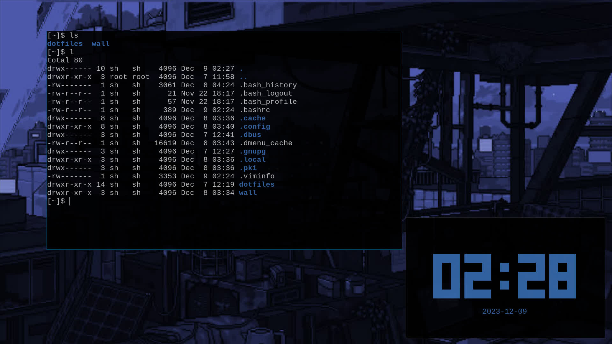

# dwl - dwm for Wayland

## This is My Fork of DWL, the Wayland Compositor with Patches



DWL has a few dependencies that need to be installed for it to run on your
system.

### Dependencies

#### Void Linux

    
    
    sudo xbps-install -S wlroots wlroots-devel wayland-protocols wbg wlr-randr xdg-desktop-portal-wlr

#### Arch Linux

    
    
    sudo pacman -S wlroots wayland-protocols wbg wlr-randr xdg-desktop-portal-wlr

The background image can be set using `wbg`. If you have multiple screens, you
can configure them using `wlr-randr`.

### Patches

  * [Always Center](patches/alwayscenter.diff)
  * [Attach Bottom](patches/attachbottom.diff)
  * [Auto Start](patches/autostart.diff)
  * [Per Tag](patches/pertag.diff)
  * [Restart Dwl](patches/restartDwl.diff)
  * [Swallow](patches/swallow.diff)
  * [Vanity Gaps](patches/vanitygaps.diff)

### Installing DWL

To install DWL on your system:

```bash
git clone --depth=1 https://github.com/elbachir-one/dwl
cd dwl/
make
sudo make clean install
```

After installation, you can reboot your system and start DWL by typing `dwl`
in the TTY.

**Note:** DWL does not include a bar by default. You will need to choose and
set up a bar on your own. Additionally, you will need to install a terminal
emulator and a program launcher, such as `bmenu` or `dmenu` for Wayland.

### Installing dmenu-wayland

To install `dmenu-wayland`, first install the dependencies: `meson` and
`ninja`.

    
    
    git clone https://github.com/nyyManni/dmenu-wayland.git
    cd dmenu-wayland
    mkdir build && meson build
    ninja -C build
    sudo ninja -C build install

### Keybindings

  * **Modkey = Alt**
  * `Modkey + p` → Launch `dmenu-wayland`
  * `Modkey + Shift + Return` → Start the terminal (e.g., alacritty)
  * `Modkey + Shift + q` → Restart DWL
  * `Modkey + Shift + c` → Close programs

**Note:** Feel free to customize this configuration to suit your preferences.

### Thank You
